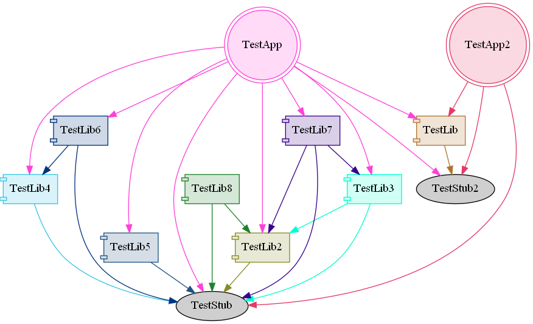

## **Current test status:**

**Platform** |  **Test Suite** | **Status (develop)**
:----------- |:--------------- | :------------------:
Linux        | Python 2.7      | [,branch:(develop)/statusIcon)](https://dev.aegresco.com/teamcity/viewType.html?buildTypeId=Csbuild_LinuxPython2&branch_Csbuild=develop&guest=1)
Linux        | Python 3.6      | [,branch:(develop)/statusIcon)](https://dev.aegresco.com/teamcity/viewType.html?buildTypeId=Csbuild_LinuxPython3&branch_Csbuild=develop&guest=1)
|||
macOS        | Python 2.7      | [,branch:(develop)/statusIcon)](https://dev.aegresco.com/teamcity/viewType.html?buildTypeId=Csbuild_MacOSPython2&branch_Csbuild=develop&guest=1)
macOS        | Python 3.8      | [,branch:(develop)/statusIcon)](https://dev.aegresco.com/teamcity/viewType.html?buildTypeId=Csbuild_MacOSPython3&branch_Csbuild=develop&guest=1)
|||
Windows      | Python 2.7      | [,branch:(develop)/statusIcon)](https://dev.aegresco.com/teamcity/viewType.html?buildTypeId=Csbuild_WindowsPython27&branch_Csbuild=develop&guest=1)
Windows      | Python 3.8      | [,branch:(develop)/statusIcon)](https://dev.aegresco.com/teamcity/viewType.html?buildTypeId=Csbuild_WindowsPython38&branch_Csbuild=develop&guest=1)

---

CSBuild is a language-agnostic build system focused on maximizing developer iteration time and providing tools for enabling developers to improve their build workflow. Currently, CSBuild is undergoing a complete rewrite to address some core architecture issues with the original iteration. It gets closer every day, but hasn't quite reached feature parity with the original CSBuild.

What it currently can do:
- Build basic C++, java, objective-c, and assembly files
- Build on Windows, Mac, BSD, Linux, android, PS3, PS4, and PSVita systems (language support varies by system)
- Be extended with tools to work in any language
- Support macro processing in all strings (i.e., `csbuild.SetOutputDirectory("{toolchainName}/{architectureName}/{targetName}")`)
- Generate project files for Visual Studio 2010, 2012, 2013, 2015, 2017, and 2019.
- Dependency graph generation by running with --dg
  

What's still missing that exists in old CSBuild:
- "Chunking" - intelligently combining multiple translation units into one and breaking them back apart to improve build turn-around
- Solution generation for QtCreator
- Build GUI showing the progress of individual files and projects as they're build
- Build profiler to analyze and identify headers and lines of code that are expensive to compile

The core architecture is much more stable and maintainable than old CSBuild's, and tools are easier to implement than they were before. The new architecture also successfully decouples csbuild from the c++ language, allowing it to be truly versatile and language-agnostic. The new csbuild also cuts down considerably on wasted time during initial startup. Now that the majority of the core features have been implemented, we expect feature parity for the tools and target platforms supported by old CSBuild to start coming online very quickly, shortly followed by solution generation, chunking, and the gui tools.

Documentation hasn't been created for the new version of csbuild yet; however, we have created a large suite of tests, so in the short term, a lot of information can be gleaned from looking at the make.py file in each test.

Code for old csbuild, for those interested in it, can be found here: https://github.com/SleepingCatGames/csbuild

---

## Development Notes

Frozen requirements files are provided for both Python 2 & 3.  Currently, the only dependency is pylint which is only needed when running the pylint unit test.  If using virtual Python environments for csbuild development, please keep in mind that the pylint test will fail on macOS under the Python 2 virtual environment.  However, if you install pylint to your system-installed copy of Python 2.7 and run against that, the pylint unit test will pass.  This issue does not seem to be present on Windows or Linux and all other unit tests are unaffected by the presence of a Python2 virtual environment on macOS.
